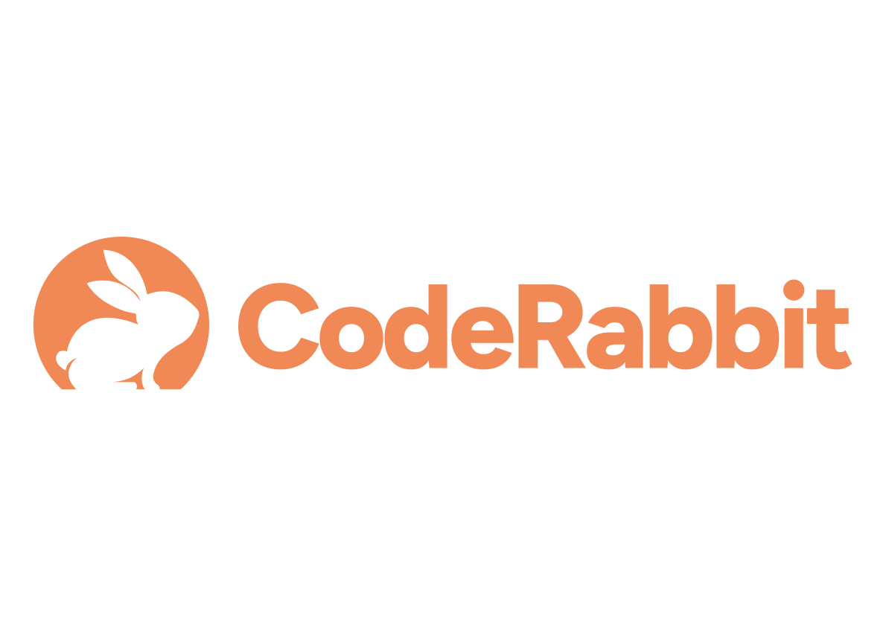

[](https://github.com/jzombie/etf-matcher/pulls?q=is%3Apr+is%3Aclosed)

# ETF Matcher

Source code for [ETFMatcher.com](https://etfmatcher.com), a utility that leverages machine learning to analyze financial disclosures, helping users customize virtual portfolios and discover ETFs tailored to their investment strategies.

## Build Requirements

- A Unix terminal shell (such as Bash or Zsh)
- Docker version 26.1.3 or later (earlier versions may also work but are not guaranteed)
- Proprietary `.bin` files used for stock analysis
- A compatible `.env` file (details not provided)

### Optional

- make (utility) - Helpful.

You can skip using Docker altogether if that's your thing, but it will be harder to build.

## Development

```bash
make build-dev
make start-dev
```

Other development commands are available by running:

```bash
make help # Or just `make`
```

## Deployment

```bash
make build-prod
```

Built artifacts will be written to `{project_root}/dist`.

## Platform Testing

<a href="https://www.browserstack.com" target="_blank"></a>

Thanks to [BrowserStack Open-Source Program](https://www.browserstack.com/open-source) for providing us with a free account which lets us test on real devices and operating systems.

## Code Reviews

Code reviews powered by [https://coderabbit.ai/](https://coderabbit.ai/) (as of August 22, 2024).

<a href="https://coderabbit.ai" target="_blank"></a>

## License

[MIT License](LICENSE) (c) 2024 Jeremy Harris.
